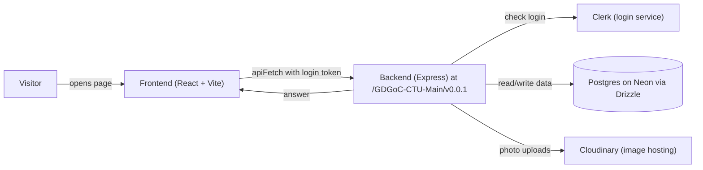

# Architecture Overview (student-friendly summary)

This is the short version of how the GDG-CTU site fits together. For full details see [`gdg_backend_architecture.md`](gdg_backend_architecture.md) (backend design, diagrams, database tables) and [`admin-cms-spec.md`](admin-cms-spec.md) (Admin CMS rules, spec v0.4).

**One-sentence version:** the React website (frontend) shows pages to visitors and asks a Node server (backend) for data; the server checks logins with Clerk, reads/writes the database, and stores photos in Cloudinary.

## Request flow (what happens when someone opens a page)

In words: (1) the visitor opens a page, (2) the frontend calls the backend with `apiFetch`, attaching the login token if signed in, (3) the backend verifies the token with Clerk, (4) it reads the database and returns the answer, (5) photos go to/from Cloudinary. Public pages skip the login step; `/admin` pages require it (`ProtectedRoute` in `App.jsx` sends strangers to `/admin/login`).

## Folder map (where to look)

- `backend/src/server.ts` — the starting point: loads settings, allows only the `FR_ORIGIN` website address (CORS), turns on the Clerk login check, and mounts all features at `/GDGoC-CTU-Main/v0.0.1`.
- `backend/src/modules/` — one folder per feature (events, team, gallery, partners, content, ...). Each has its own addresses, database table shape, and checks.
- `backend/src/middleware/` + `config/` + `utils/` — shared pieces: login/role checks, database/Cloudinary connections, logging and validation helpers.
- `frontend/src/main.jsx` — starts the website and connects login (`ClerkProvider`); `frontend/src/App.jsx` — all page addresses.
- `frontend/src/api/client.js` — the only file that talks to the backend (`apiFetch` adds the login token and the `VITE_API_URL` prefix).
- `frontend/src/pages/` + `components/` — screens and reusable pieces (`ProtectedRoute` guards `/admin`, `AdminShell` is the dashboard layout).
- `frontend/vercel.json` — one rewrite rule so refreshing `/about`, `/events`, etc. doesn't show a 404 when hosted on Vercel.

## 5 core concepts, explained simply

1. **CMS-writes / public-reads** — "CMS" = the private `/admin` dashboard. Anyone can *read* the public site; only signed-in active admins can *write* (create/edit/delete) through the dashboard. The backend enforces this, not just the buttons.
2. **Clerk auth (401 vs 403)** — Clerk is the login service. `401` means "we don't know who you are — please log in." `403` means "we know you, but your account isn't an active admin." If you see these, it's a login/permission issue, not broken code.
3. **Versioned base path + CORS + `VITE_API_URL`** — every backend address starts with `/GDGoC-CTU-Main/v0.0.1` (the version, so future changes don't break today's site). CORS is a browser safety rule: the backend answers *only* the one website address in `FR_ORIGIN`. `VITE_API_URL` is the frontend's copy of the backend address — both must match or calls fail.
4. **Drizzle (Neon) + Cloudinary** — Drizzle is the tool our code uses to talk to the Postgres database hosted on Neon (all text/data lives there; reads and writes go straight to the database). Cloudinary hosts photo files (uploads capped at 5 MB via multer, a file-upload helper).
5. **Slugs, `site_content` keys, and `status` fields** — a `slug` is a URL-friendly name (e.g. `hackathon-2026` for `/events/hackathon-2026`). `site_content` rows are labeled text blocks (each has a `sectionKey` like `home-hero`) the dashboard edits. `status` marks whether an item is a `draft` (hidden) or `published` (visible).

## API routes: public vs admin

Base path for everything: `/GDGoC-CTU-Main/v0.0.1` (so the health check is `GET <backend>/GDGoC-CTU-Main/v0.0.1/admins`).

| Route family | Example | Who can use it |
|---|---|---|
| Public reads | `GET /admins`, public event/gallery/partner listings | Anyone, no login |
| Admin writes | `POST / PATCH / DELETE` on events, team, partners, gallery, content, media, settings | Signed-in active admin only (Clerk token required; otherwise `401`/`403`) |
| Login pages | `/admin/login` (sign-in screen), `/admin/*` dashboard screens | `/admin/*` needs login via `ProtectedRoute` |

> The exact per-feature addresses live in `backend/src/modules/` and the full rules in [`admin-cms-spec.md`](admin-cms-spec.md). When adding a feature: add its module in the backend, call it from the frontend only via `apiFetch`, and guard its dashboard page with `ProtectedRoute`.
